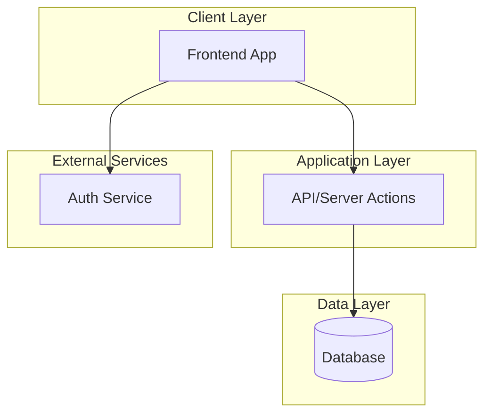

# PRD: [Nome do Projeto]

> Template baseado no 8-Step Method para criação de PRDs completos

---

## 1. Visão Geral do Produto

### 1.1 Elevator Pitch
[Resumo em 1-2 frases que explica o que o produto faz e seu valor único]

### 1.2 Problem Statement
[Descrição clara do problema que o produto resolve]

### 1.3 Target Audience

| Segmento | Descrição | Necessidades |
|----------|-----------|--------------|
| **Primário** | [Usuários principais] | [O que precisam] |
| **Secundário** | [Usuários secundários] | [O que precisam] |
| **Terciário** | [Outros usuários] | [O que precisam] |

### 1.4 Unique Selling Proposition (USP)
[O que diferencia este produto dos concorrentes]

### 1.5 Target Platforms
- [ ] Web (Responsive)
- [ ] Mobile iOS
- [ ] Mobile Android
- [ ] Desktop App
- [ ] API

### 1.6 Monetization Strategy
[Modelo de negócio: Freemium, SaaS, Marketplace, etc.]

---

## 2. Features & User Stories

### 2.1 Feature: [Nome da Feature]

#### Descrição
[2-3 frases sobre o que a feature faz]

#### User Stories

| Persona | Story | Prioridade |
|---------|-------|------------|
| [Tipo de usuário] | As a [X], I want to [Y], so that [Z] | P0/P1/P2 |
| [Tipo de usuário] | As a [X], I want to [Y], so that [Z] | P0/P1/P2 |

#### Acceptance Criteria
- [ ] [Critério 1]
- [ ] [Critério 2]
- [ ] [Critério 3]

#### UX/UI Considerations

**Core Experience:**
- Estado inicial da tela
- Estados de transição
- Feedback visual para ações
- Animações

**Edge Cases:**
- Tratamento de erros
- Estados vazios
- Loading states
- Limites e validações

---

### 2.2 Feature: [Nome da Feature 2]

[Repetir estrutura acima para cada feature]

---

## 3. Technical Architecture

### 3.1 Tech Stack

| Layer | Technology | Justificativa |
|-------|------------|---------------|
| Frontend | [Ex: Next.js] | [Por que escolhemos] |
| Backend | [Ex: Server Actions] | [Por que escolhemos] |
| Database | [Ex: PostgreSQL] | [Por que escolhemos] |
| Auth | [Ex: Clerk] | [Por que escolhemos] |
| Hosting | [Ex: Vercel] | [Por que escolhemos] |

### 3.2 System Diagram



### 3.3 Technical Requirements

#### Performance
- [ ] [Requisito de performance]
- [ ] [Requisito de performance]

#### Scalability
- [ ] [Requisito de escalabilidade]
- [ ] [Requisito de escalabilidade]

#### Security
- [ ] [Requisito de segurança]
- [ ] [Requisito de segurança]

#### Accessibility
- [ ] WCAG 2.1 AA compliance
- [ ] Keyboard navigation
- [ ] Screen reader support

---

## 4. Design System

### 4.1 Color Palette

#### Primary Colors
| Nome | Hex | Uso |
|------|-----|-----|
| Primary | `#000000` | Botões principais, ênfase |
| Primary Light | `#333333` | Hover states |

#### Functional Colors
| Nome | Hex | Uso |
|------|-----|-----|
| Success | `#22C55E` | Confirmações |
| Error | `#EF4444` | Erros |
| Warning | `#F59E0B` | Alertas |
| Info | `#3B82F6` | Informações |

### 4.2 Typography

| Style | Font | Size | Weight | Line Height |
|-------|------|------|--------|-------------|
| H1 | Inter | 32px | Bold | 40px |
| H2 | Inter | 24px | Bold | 32px |
| H3 | Inter | 20px | Semibold | 28px |
| Body | Inter | 16px | Regular | 24px |
| Small | Inter | 14px | Regular | 20px |

### 4.3 Spacing System
- **4px** - Micro
- **8px** - Small
- **16px** - Default
- **24px** - Medium
- **32px** - Large
- **48px** - XLarge

### 4.4 Component Styling

#### Buttons
- Primary: Brand color, white text, 8px radius
- Secondary: Outlined, brand border
- Text: No background

#### Cards
- Background: White
- Shadow: subtle
- Radius: 12px
- Padding: 16px

#### Inputs
- Height: 48px
- Radius: 8px
- Border: 1px neutral

### 4.5 Motion & Animation
- Standard: 200ms ease-out
- Emphasis: 300ms spring
- Micro: 150ms ease-in-out

---

## 5. Data Models

### 5.1 Entity: [Nome]

```prisma
model EntityName {
  id        String   @id @default(cuid())
  field1    String
  field2    Int
  createdAt DateTime @default(now())
  updatedAt DateTime @updatedAt

  // Relations
  relation  Relation[]
}
```

#### Indexes
- `field1` - Para buscas frequentes
- `(field1, field2)` - Composite para queries específicas

---

## 6. API Specifications

### 6.1 Endpoints

#### `POST /api/resource`
**Descrição:** Cria novo recurso

**Request:**
```json
{
  "field1": "string",
  "field2": 123
}
```

**Response (201):**
```json
{
  "id": "cuid",
  "field1": "string",
  "field2": 123,
  "createdAt": "2024-01-01T00:00:00Z"
}
```

**Errors:**
- `400` - Validation error
- `401` - Unauthorized
- `500` - Server error

---

## 7. Project Rules & Conventions

### 7.1 Code Style
- Naming: camelCase for variables, PascalCase for components
- Files: kebab-case
- Max file size: 300 lines

### 7.2 Git Workflow
- Branch: `feature/description`, `fix/description`
- Commits: Conventional commits (feat:, fix:, docs:)
- PRs: Require review, link issues

### 7.3 Testing
- Unit tests: Co-located, `*.test.ts`
- Coverage: Minimum 80%

---

## 8. Implementation Plan

### Phase 1: Foundation
| Step | Task | Files | Dependencies |
|------|------|-------|--------------|
| 1.1 | Initialize project | package.json, tsconfig | None |
| 1.2 | Configure database | prisma/schema.prisma | 1.1 |
| 1.3 | Setup auth | middleware.ts | 1.1, 1.2 |

### Phase 2: Core Features
| Step | Task | Files | Dependencies |
|------|------|-------|--------------|
| 2.1 | [Feature 1] | components/*, actions/* | Phase 1 |
| 2.2 | [Feature 2] | components/*, actions/* | 2.1 |

### Phase 3: Polish & Deploy
| Step | Task | Files | Dependencies |
|------|------|-------|--------------|
| 3.1 | Add tests | tests/* | Phase 2 |
| 3.2 | Configure CI/CD | .github/workflows/* | 3.1 |
| 3.3 | Deploy | - | 3.2 |

---

## 9. Task Checklist

### Setup
- [ ] Initialize project
- [ ] Configure TypeScript
- [ ] Setup database
- [ ] Configure authentication
- [ ] Create base components

### Features
- [ ] Feature 1 - Backend
- [ ] Feature 1 - Frontend
- [ ] Feature 1 - Tests
- [ ] Feature 2 - Backend
- [ ] Feature 2 - Frontend
- [ ] Feature 2 - Tests

### Polish
- [ ] Performance optimization
- [ ] Accessibility audit
- [ ] Security review
- [ ] Documentation

### Deploy
- [ ] Environment setup
- [ ] CI/CD pipeline
- [ ] Monitoring
- [ ] Launch

---

## 10. Appendix

### 10.1 Glossary
| Term | Definition |
|------|------------|
| [Term] | [Definition] |

### 10.2 References
- [Link to design files]
- [Link to research]
- [Link to competitors]

### 10.3 Open Questions
- [ ] [Questão pendente 1]
- [ ] [Questão pendente 2]

---

*Documento criado em: [Data]*
*Última atualização: [Data]*
*Versão: 1.0*
